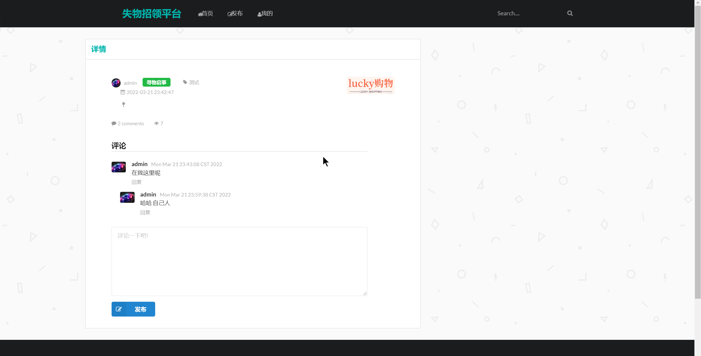
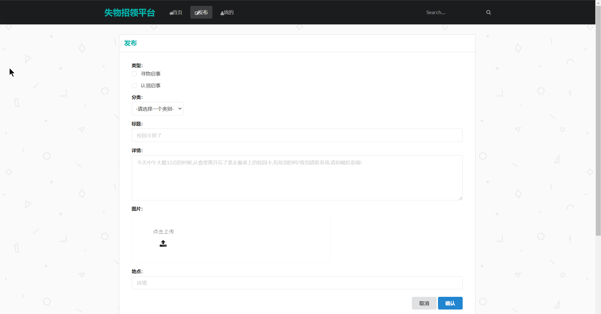
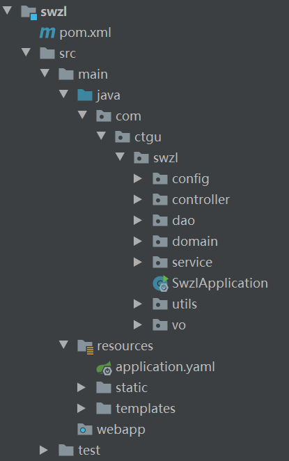

基于Springboot的失物招领平台
=
### 完整代码获取地址：从戎源码网 ([https://armycodes.com/](https://armycodes.com/))
### 作者微信：19941326836  QQ：952045282 
### 承接计算机毕业设计、Java毕业设计、Python毕业设计、深度学习、机器学习
### 选题+开题报告+任务书+程序定制+安装调试+论文+答辩ppt 一条龙服务
### 所有选题地址https://github.com/nature924/allProject

一、项目介绍
---
基于SpringBoot框架的失物招领平台，有用户和管理员两个角色，主要功能如下
### 1. 用户功能：
- 发布失物公告：用户可以发布自己的失物信息
- 失物分类：用户可以根据失物的类型进行分类查看
- 我的报失信息：用户可以查看自己发布的失物信息

### 2. 管理员功能：
- 人员管理：管理员可以对系统中的用户进行管理，包括添加、编辑和删除用户的基本信息。
- 启事管理：管理员可以审核和管理用户发布的失物信息，包括发布状态、处理状态等。
- 公告管理：管理员可以发布系统公告，包括寻物启事、招领信息等，提供给用户查看。
- 反馈管理：管理员可以查看用户的反馈信息，包括用户对失物招领系统的意见、建议等。

### 3. 管理员对丢失物品进行信息化管理：
- 管理员可以记录丢失物品的详细信息
- 管理员可以对已找回的失物进行标记
- 管理员可以根据失物分类进行管理

二、项目技术
---
- 编程语言：Java
- 数据库：MySQL
- 项目管理工具：Maven
- 前端技术：VUE、HTML、Jquery、Bootstrap
- 后端技术：Spring、SpringMVC、MyBatis

三、运行环境
---
- 操作系统：Windows、macOS都可以
- JDK版本：JDK1.8以上都可以
- 开发工具：IDEA、Ecplise、Myecplise都可以
- 数据库: MySQL5.7以上都可以
- Tomcat：任意版本都可以
- Maven：任意版本都可以

四、运行截图
---
### 论文截图：

### 程序截图：

